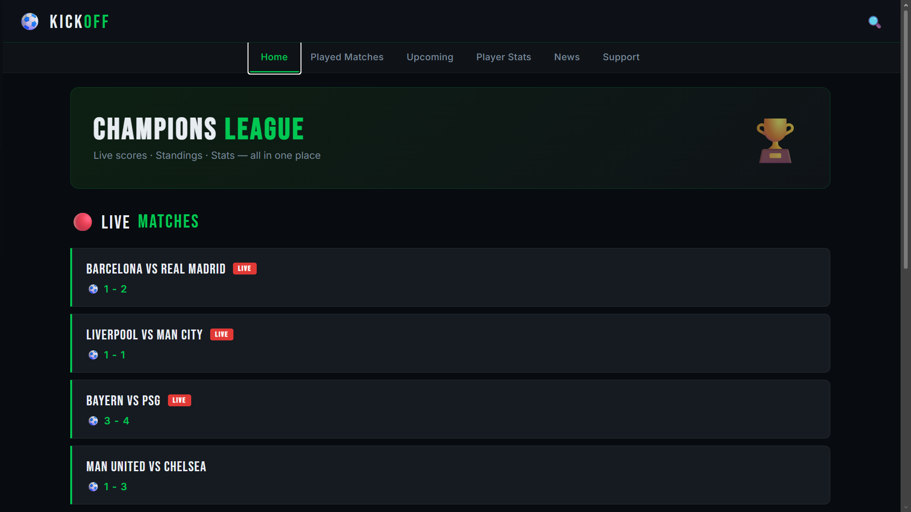
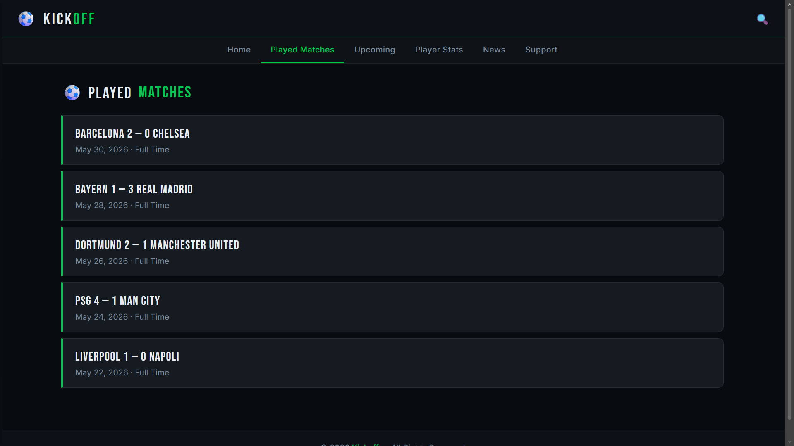
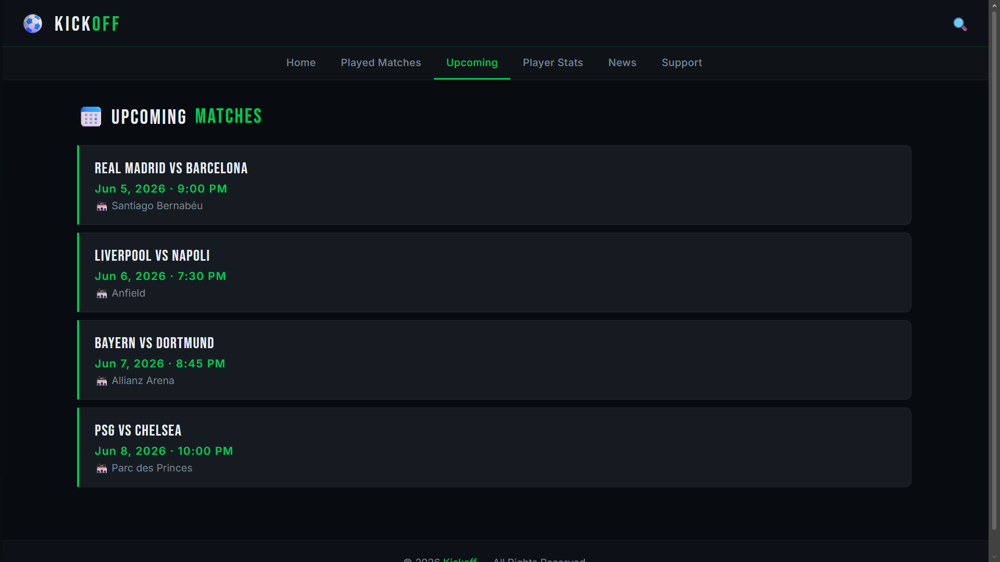
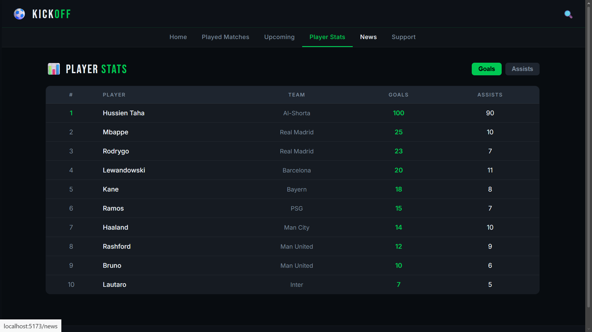
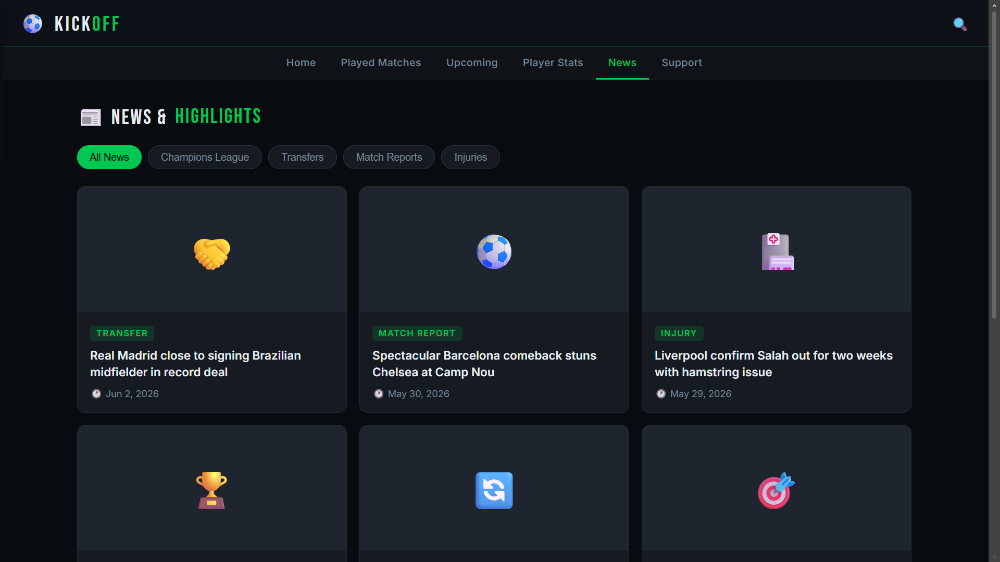
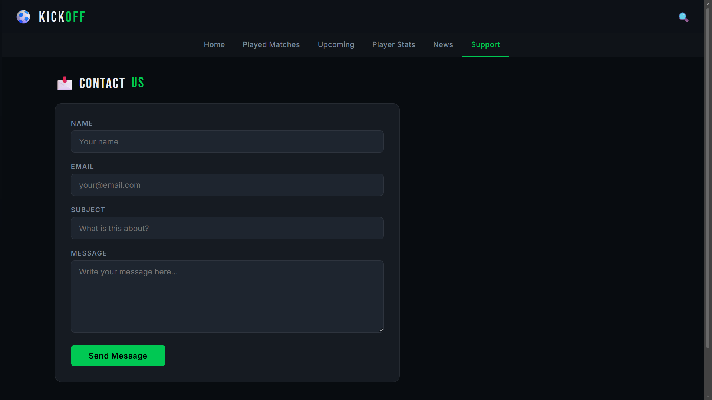

# ⚽ Kickoff — Football Tracking Web App

## Project Description

Kickoff is a football tracking web application built with ReactJS as part of CSCI390 Web Programming (Phase 2). It displays live match scores, played matches, upcoming fixtures, player statistics, football news & highlights, and a contact form. The app uses React Router DOM for client-side navigation between pages.

## Live Demo

> Add your deployed link here after hosting on Vercel / Netlify / GitHub Pages  
> Example: `https://kickoff-app.vercel.app`

## Technologies Used

- **ReactJS** (v19) with Vite
- **React Router DOM** (v7) — client-side routing
- **Custom CSS** — responsive design, media queries
- **Google Fonts** — Bebas Neue, Inter

## Pages

1. **Home** — Live match scores with LIVE badge + Champions League standings table
2. **Played Matches** — Recent match results with dates
3. **Upcoming Matches** — Scheduled fixtures with time and venue
4. **Player Stats** — Sortable goals/assists leaderboard
5. **News & Highlights** — Filterable news cards by category
6. **Contact / Support** — Contact form with submit state handling

## Screenshots

### Home Page



### Played Matches



### Upcoming Matches



### Player Stats



### News & Highlights



### Contact



## Setup Instructions

### Run Locally

```bash
npm install
npm run dev
```

Open [http://localhost:5173] in your browser.

## Project Structure

```
kickoff-app/
├── public/
├── screenshots/
│   ├── home.png
│   ├── matches.png
│   ├── upcoming.png
│   ├── players.png
│   ├── news.png
│   └── contact.png
├── src/
│   ├── components/
│   │   ├── Navbar.jsx
│   │   ├── Navbar.css
│   │   ├── Footer.jsx
│   │   └── Footer.css
│   ├── pages/
│   │   ├── Home.jsx
│   │   ├── Matches.jsx
│   │   ├── Upcoming.jsx
│   │   ├── Players.jsx
│   │   ├── News.jsx
│   │   └── Contact.jsx
│   ├── App.jsx
│   ├── App.css
│   └── main.jsx
├── index.html
├── package.json
├── vite.config.js
└── README.md
```

## Group Contribution Statement

| Member      | Contribution                     |
| ----------- | -------------------------------- |
| JihadKhalaf | Home page, Navbar, routing setup |
| JadSweidan  | Matches, Upcoming, Players pages |
